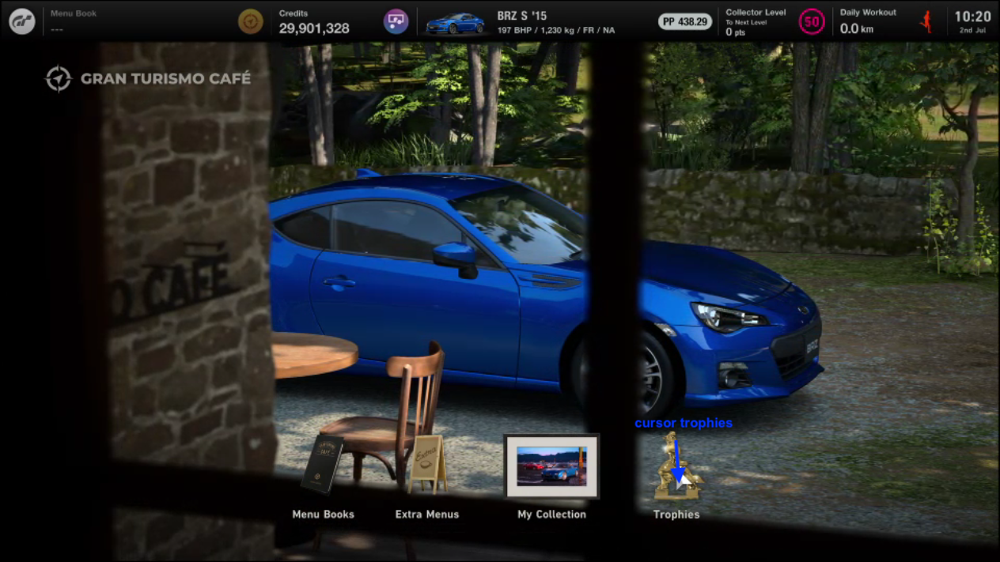
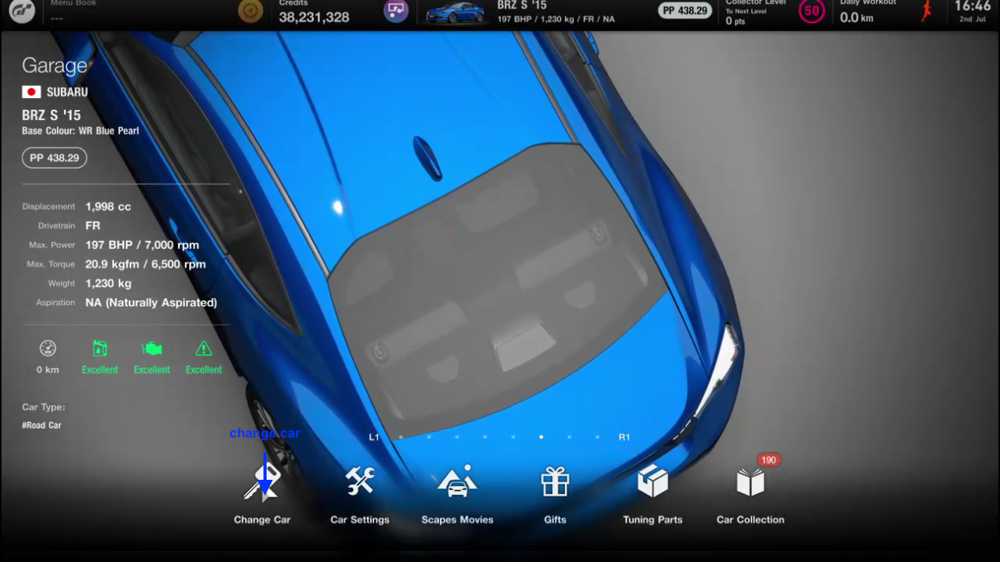

# GT7 Ticket Bonanza

You can download the zip of the [lastest release here](https://github.com/surelook/ticket-bonanza/releases/latest).

## How to Run

1. Install vigem - https://github.com/ViGEm/ViGEmBus/releases/download/setup-v1.17.333/ViGEmBusSetup_x64.msi
2. Install AutoHotkey - https://www.autohotkey.com/
3. Install VC All in One https://www.techpowerup.com/download/visual-c-redistributable-runtime-package-all-in-one/
4. Run GT7-Tickets.ahk
5. Click Start. 

## Additional Setup for Accurate Pixel Detection

A few pixel checks are performed during the script execution. It may be necessary to adjust the coordinates and colours of these to suit your environment.

To configure:

1. Click the Start button to begin running the script. The Remote Play window will be resized to a suitable size.
2. Click the Reset button to stop the script. Now that the size of the Remote Play window has been set you can accurately grab pixel values.
3. In the system tray, right click the Authotkey icon and select Windows Spy. 
4. Ensuring that the Remote Play window is the active window by clicking on it, take note of the Mouse's Window Position and Color values as shown in Windows Spy
5. You will need to use this to idenfity the coordinates and colour values for each of the following positions.

### 4star:

### Cursor Cafe:

### Cursor Garage:

### Cursor Trophies:

### Cursor Change Car:

